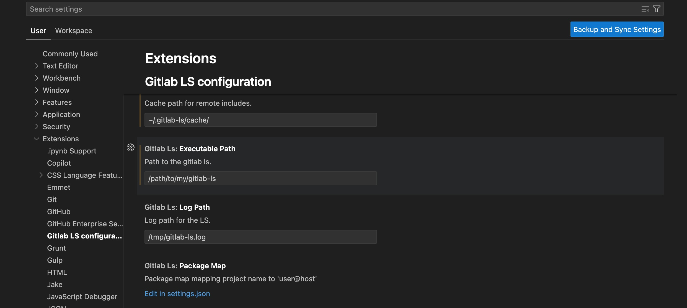

# Gitlab CI language server

## **This is not an official language server.**

I've developed this LS to help myself working with Gitlab CI files.

## Functionalities

Currently it supports only:

- _textDocument/definition_: [Link](https://microsoft.github.io/language-server-protocol/specifications/lsp/3.17/specification/#textDocument_definition)
- _textDocument/hover_: [Link](https://microsoft.github.io/language-server-protocol/specifications/lsp/3.17/specification/#textDocument_hover)
- _textDocument/completion_: [Link](https://microsoft.github.io/language-server-protocol/specifications/lsp/3.17/specification/#textDocument_completion)
- _textDocument/diagnostic_: [Link](https://microsoft.github.io/language-server-protocol/specifications/lsp/3.17/specification/#textDocument_diagnostic)
- _textDocument/diagnostic_: [Link](https://microsoft.github.io/language-server-protocol/specifications/lsp/3.17/specification/#textDocument_reference)

### Go To Definition

Both extend and main node keys support go to definition.
Supports:

- node definitions
- job extends
- job needs

```yaml
.base-job:
  something: ...

myjob:
  extends: .base-job
```

In the case above go to definition is supported for _.base-job_ and _myjob_ (if this is just an override of existing job).

For remote file includes it tries to download referenced git repository and
then use its files to jump to definition.

To clone the repository it currently only supports ssh protocol and it
automatically tries to use SSH key in SSH agent.

It will try to find the correct remote by reading current working directory remote.
In case there are multiple remotes (in cases such as forks) it is best to set the remote using the package_map option.

For example:

```
{
  ... other configuration,
  package_map: {
    "mytemplaterepository": "git@gitlab.com"
  }
}
```

in case where we are including gitlab files from a remote. For example:

```yaml
include:
  - project: mytemplaterepository
    ref: 1.0.0
    file:
      - "/.ci-template.yml"
```

Otherwise it will clone from the first remote it has access to which
doesn't guarantee that this is the file version you want.

### Autocomplete

It supports autocompletion for:

- extends
- stages
- job needs
- variables (currently only root variables, per job definition will be added later on)

### Diagnostic

It shows diagnostics on:

- invalid extends
- invalid stages

### References

It shows references for:

- node keys
- extends

## Installing

1. Download release and optionally symlink it.
2. On mac you can use `brew install alesbrelih/gitlab-ci-ls/gitlab-ci-ls`.
3. Using cargo `cargo install gitlab-ci-ls`

## Build

```sh
cargo build --release
```

Executable can then be found at _target/release/gitlab-ci-ls_

## Integration with Neovim

Currently this tool isn't available on Mason but if there will be
interest I will be add it.

If you want to include it to test it you can use:

```lua
local client = nil

vim.api.nvim_create_autocmd("FileType", {
  pattern = "yaml",
  callback = function(_)
    local root_dir = vim.fs.find(".git", { upward = true, path = vim.fn.expand("%:p:h") })[1]
    vim.notify(root_dir)
    if root_dir then
      root_dir = vim.fn.fnamemodify(root_dir, ":h")
      vim.notify(root_dir)
    else
      root_dir = vim.fn.expand("%:p:h")
    end

    if not client then
      client = vim.lsp.start_client({
        name = "gitlab-ci-ls",
        cmd = { "/path-to-gitlab-ci-ls" },
        init_options = {
          cache = "/path/where/remote/folders/will/be/cached",
          log_path = "/tmp/gitlab-ci-ls.log",
        },
        root_dir = root_dir,
        on_attach = require("lazyvim.plugins.lsp.keymaps").on_attach,
      })

      if not client then
        vim.notify("error creating LSP config")
        return
      end
    end

    vim.lsp.buf_attach_client(0, client)
  end,
})
```

## Integration with VSCode

Extenstion can be seen [here](https://marketplace.visualstudio.com/items?itemName=alesbrelih.gitlab-ci-ls).

This extension supports configuration which needs to be set up because _gitlab-ci-ls_ itself isn't installed along with the extension but it needs to be downloaded from releases, brew or built from source.



## Emacs lsp-mode configuration

To use `gitlab-ci-ls` with Emacs `lsp-mode`, reference the below sample
configuration.

```emacs-lisp
(add-to-list 'lsp-language-id-configuration '("\\.gitlab-ci\\.yml$" . "gitlabci"))
(add-to-list 'lsp-language-id-configuration '("/ci-templates/.*\\.yml$" . "gitlabci"))

(lsp-register-custom-settings
  '(("gitlabci.cache" "/path/where/remote/folders/will/be/cached")
    ("gitlabci.log_path" "/tmp/gitlab-ci-ls.log")))

(lsp-register-client
  (make-lsp-client :new-connection (lsp-stdio-connection '("gitlab-ci-ls"))
                  :activation-fn (lsp-activate-on "gitlabci")
                  :server-id 'gitlabci
                  :priority 10
                  :initialization-options (lambda () (gethash "gitlabci" (lsp-configuration-section "gitlabci")))))
```

## TODO

- [ ] Smarter way to initialize, it should support root_dir equal to nil and once file is opened it should receive/calculate new root.
- [x] Fix VSCode completion. It seems it also needs a range to correctly update text.
- [x] Rename to gitlab-ci-ls.
- [ ] References for stages
- [ ] Variables can be set in matrixes as well, this is relevant for go to definition on variable.
